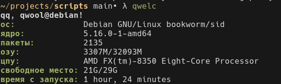

# scripts  
a collection of scripts i wrote for linux

# table of contents

- [scripts](#scripts)
- [qwelc](#qwelc)
- [note](#note)
- [hub](#hub)
- [py-server](#py-server)
- [qresmon](#qresmon)
- [screen-savecopy](#screen-savecopy)
- [sh-iso](#sh-iso)
- [vconvert](#vconvert)

# qwelc
    
a system fetch scrypt. pretty good, although it doesnt display any art in the terminal. uses external commands that should be packaged with any distro released in the past 20 years anyway.  
it's in russian, so it looks shit in terminals without unicode support (if you're ancient enough to use one)

# note  
simple note creating script. writes to ~/notes file.  
i randomly remembered it from somewhere, but couldn't find it so i rewrote it

### usage  
```
note "i fucked your mom last night"
note -r - last 5 notes
note -l - list all notes
note -e - open your notes in an editor
hote -h - yeah youre a massive pussy xdddddddddddddd
```

### flags
```
-r to fully display your notefile
-l to only display th first 5 lines
-e to open it with your $EDITOR
-h if you need help because you are a fucking pussy
```

# hub   
git clones repos from different services or from any https link  
available services:   
	- github, gh, hub  
	- gitlab, gl, lab  
	- gitea, t, gitea  
	- custom, c, git

### usage  
```
hub [https link] - clones a repo from http  
hub [git host] [repository] - clones [repo] from [host]  
hub c [host] [repo] - clones [repo] from [host]  

examples (these all copy the same repo):  
hub https://github.com/qwool/scripts  
hub gh qwool/scripts  
hub c https://github.com qwool/scripts  
```


# py-server
a simple web server using python. creates a server on 127.0.0.1

### usage
```
py-server - serves a server on 127.0.0.1:9000 (default)
py-server 8080 - creates a server on a cutom port (127.0.0.1:9000)
```

# qresmon
a simple resource monitor, abandoned due to slow performance and relying on so many packages you would've been better off using btop.  
i dont recommend you use it, but i want to preserve this

dependencies: ```sysstat bc```


# screen-savecopy
uses gnome-screenshot to screenshot and saves it with adequate naming

# sh-iso
convert the ./shared folder to an ISO.  
supposed to be used for transferring files from host to ancient VMs

# vconvert
turns preallocation off for a virtual qcow2 drive, saves a lot of space.

### usage
```vconvert *source* *destination*```
